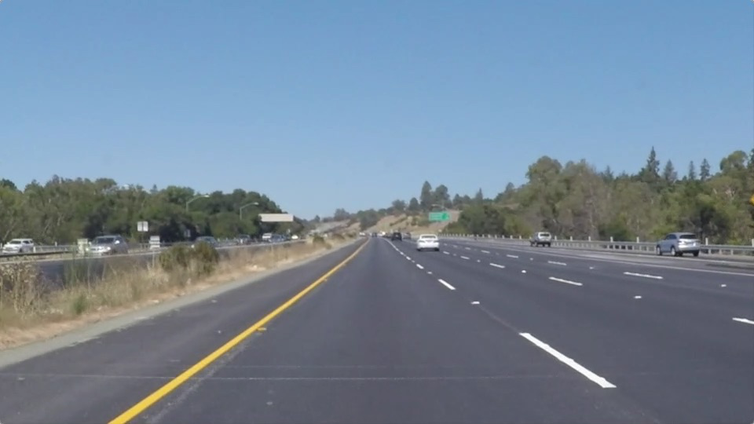
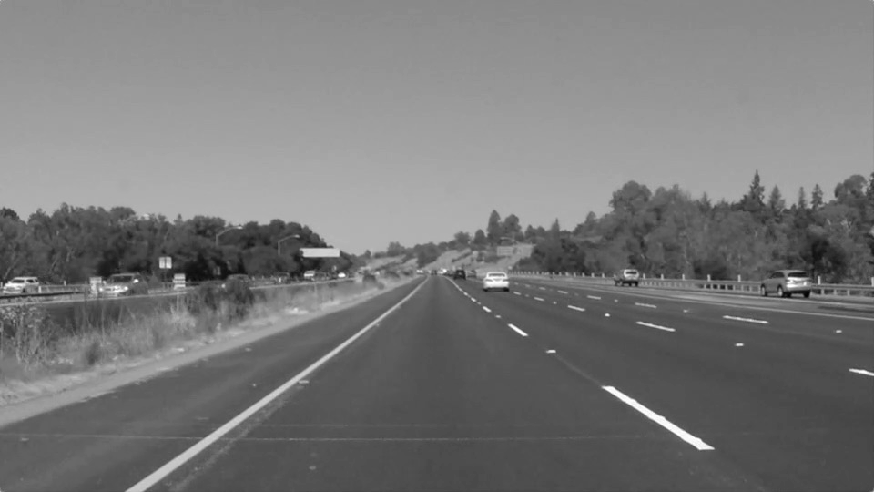
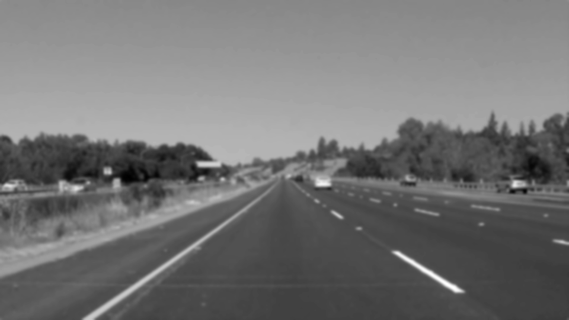
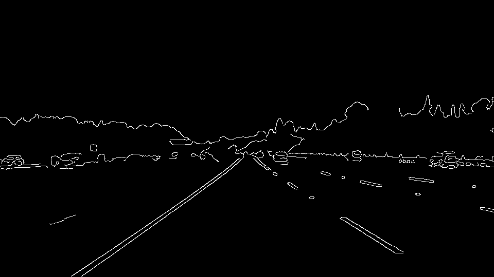
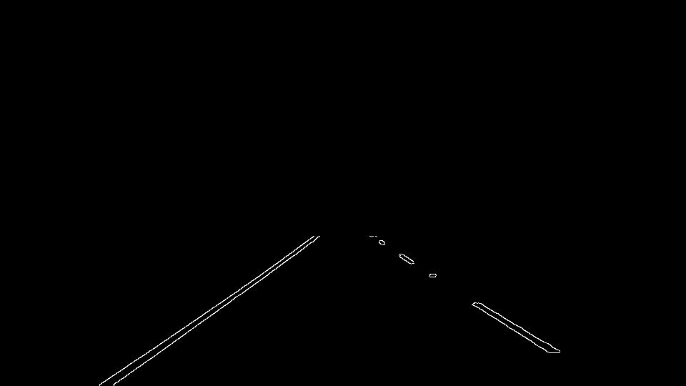
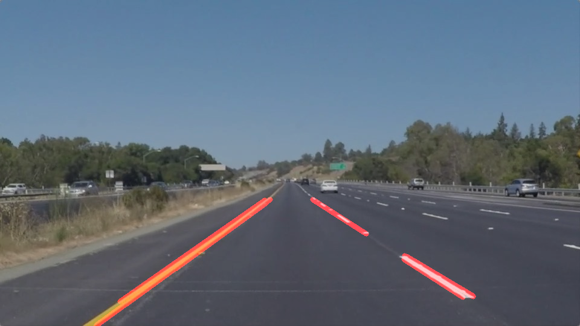

# **Finding Lane Lines on the Road** 

## Writeup Template

### You can use this file as a template for your writeup if you want to submit it as a markdown file. But feel free to use some other method and submit a pdf if you prefer.

---

**Finding Lane Lines on the Road**

The goals / steps of this project are the following:
* Make a pipeline that finds lane lines on the road
* Reflect on your work in a written report

[//]: # (Image References)

![image1]: ./test_images_output/solidYellowCurve_output.jpg "Original image"
![image2]: ./test_images_output/solidYellowCurve_gray.jpg "Grayscaled"
![image3]: ./test_images_output/solidYellowCurve_gray_blurred.jpg "Blurred image using Gaussian blur"
![image4]: https://github.com/davorrr/SDCar---Lane-lines-detection/blob/master/test_images_output/solidYellowCurve_canny.jpg "Detected edges"
![image5]: ./test_images_output/solidYellowCurve_masked_canny.jpg "Region of interest mask applied"
![image6]: ./test_images_output/solidYellowCurve_lines.jpg "Lane lines detected using Hough transform"
---

### Reflection

### 1. Describe your pipeline. As part of the description, explain how you modified the draw_lines() function.

I made 2 pipelines: process_image and process_image_robust. First pipeline was written to process test videos while the second one I wrote in attempt to process the challenge video. 
Both pipelines are similar in respect with the number of steps and the only difference is different set of parameters used for Canny edge detection function and Hough lines function.

The pipelines consist of 5 steps:
 
**-Grayscaling,** 

**-Blurring using Gaussian blur low pass filter,**

 

**-Canny edge detection,**

 

**-Applying region of interest mask,**

**-Drawing of the Hough lines on the color image.**

Regarding the provided helper functions I made changes to the region_of_interest function and I wrote the draw_lines_continuos function in additon to draw_lines. The changes on 
region_of_interest include writing the vertices of the region inside the function where the were first scaled so that they could be used in both test videos and challenge video since they
are of different size. 

In order to identify and clearly mark the full extent of the lane i wrote the draw_lines_cont function which includes sorting of the provided Hough lines to left and right lane line and 
than for both types I found the exteme points on the set of lines. After that I used those points to calculate polinomial coeffiecients in order to be able to extrapolate the line to the 
borders of the region of interest.

The pipeline was first developed using the provided images and then tested on the first video. Afterward it was improved using the new draw_lines_cont function.

I tried to use the same pipeline on the challenge video with retuned parameters but I am not quite satisfied with the results. I atempted to improve the the pipeline by first calculating
the polinomial parameters of every Hough line after sorting it and afterwards averaging and extrapolating them but that approach has failed. 

### 2. Identify potential shortcomings with your current pipeline

Potential shortcomings are best shown when the challenge video is passed through the pipeline. When there are changes in the road color or when cars from adjacent lane enter the region of
interest the Hough lines are wrongly calculated.

And of course the pipeline works as long as there are conspiquous lines on the road.

Another shortcoming is that the pipeline works as long as the road has a certain level of curvature. If the road becomes more curvy the pipeline falls apart.

### 3. Suggest possible improvements to your pipeline

One possible improvement is to implement averaging across a number of particular images in the video. That way the sudden short lasting changes in road color could be filtered out. The 
solution would be when the change occurs points from a former image are used.

In order to maintain the pipeline consistency even on a very curvy road a set of several connecting lines to identify road lanes could be used.

